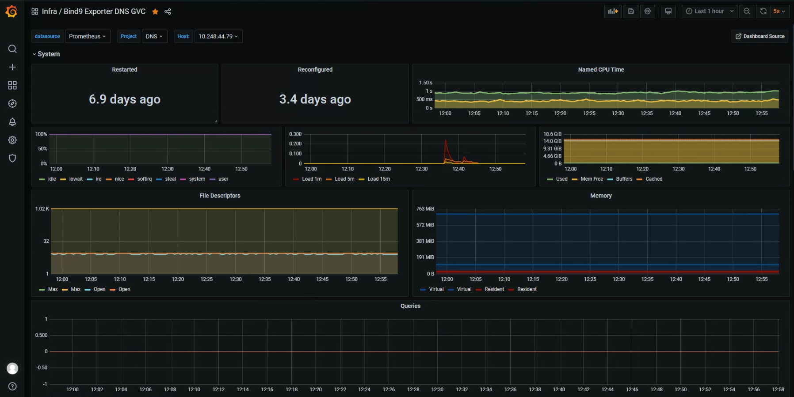
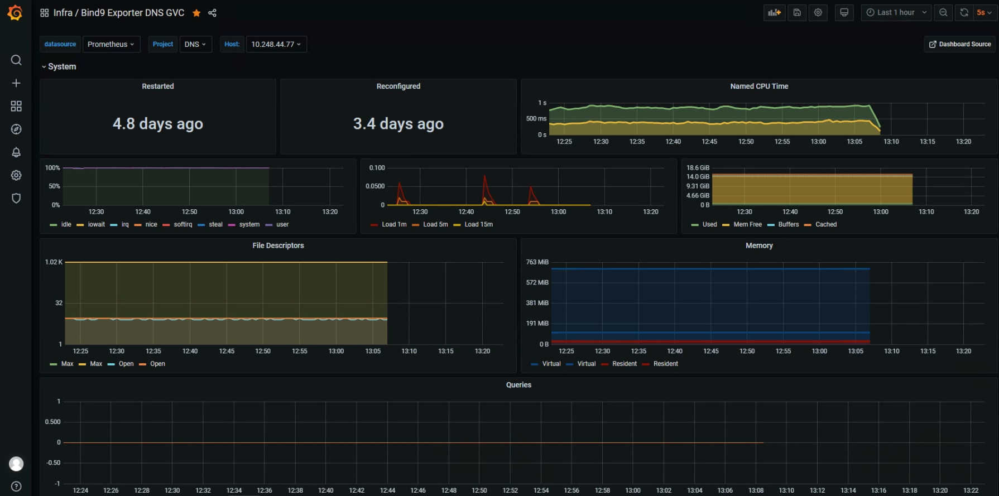
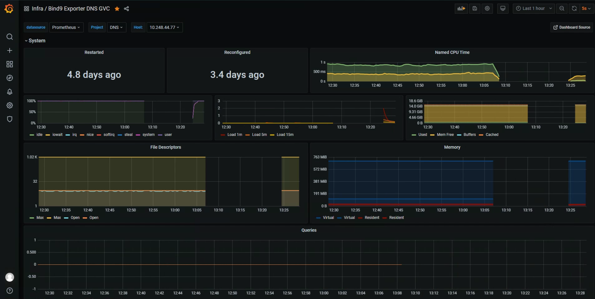
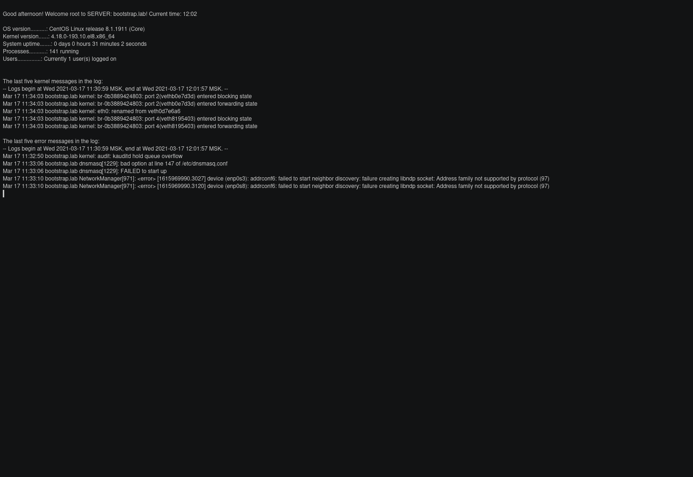
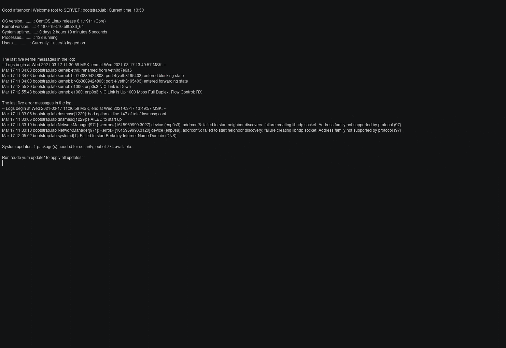

# Инструкция сменного персонала DNS

## Общее описание

Сбои разделены на два типа операционные ошибки и ошибки конфигурации.

* Операционные ошибки - возникают в процессе выполнения различных операций, таких как формирование "негативного кеша". Устраняются без привлечения администратора.
* Ошибки конфигурации - связаны с неправильным внесением изменений в конфигурационные файлы. Устраняются с привлечением администратора.

Ниже приведено описание нахождения и устранения сбоев.

## Проверка работоспособности

### 1. Необходимо проверить доступность и сбор метрик в Grafana.
   
   1.1. Сервер доступен
   
   Если сервер доступен необходимо выполнить [разрешение имен](#3-проверка-разрешения-имен).
   
   1.2. Сервер не доступен
   
   Если сервер не доступен следует проверить проверить доступность по сети и зайти на сервер по SSH, и проверить состояние сервиса. При недоступности по сети проверить состояние сервера или виртуальной машины, должна находится в статусе `PowerOn`.
   
   1.3. Убедившись в возобновление доступности
   
   Необходимо выполнить [разрешение имен](#3-проверка-разрешения-имен).

### 2. Проверка состояния сервиса.

Для проверки необходимо запустить сценарий проверки: `named-healthy-check`. Так как сервис может быть запушен в разных режимах с подменой дерева каталогов (unit name: named-chroot.service) или без (unit name: named.service), сценарий проверяет какой из них активирован. Выводя состояние для каждого режима: <span style="color:orange">ENABLE</span> и <span style="color:orange">DISABLE</span>. Выполняет проверки: запущен ли сервис, валидность синтаксиса файлов конфигурации, валидность файлов зон. Выводя состояние для каждой проверки: <span style="color:green">PASS</span> и <span style="color:red">INVALID</span>. Выводи 7 последних сообщений из системного журнала.
   
   2.1 Сервис запещен и работает, ошибок не зафиксировано
   [](#3-проверка-разрешения-имен)
   Необходимо выполнить [разрешение имен](#3-проверка-разрешения-имен).

   2.2 Сервис запущен, но есть ошибки в синтаксисе файлов конфигурации
   [](#4-сбор-диагностической-информации)
   Необходимо запустить [сбор диагностической информации](#4-сбор-диагностической-информации) и сообщить об этом ответственным администраторам.

   2.3 Сервис остановлен
   [](#3-запуск-и-перезапуск-службы)
   Необходимо выполнить [запуск сервиса](#3-запуск-и-перезапуск-службы).

### 3. Проверка разрешения имен

Для проверки используется программа `nslookup`, в качестве аргументов необходимо передать: тип запроса, разрешаемое имя, сервер системы имен (DNS). Перед началом проверки необходимо сбросить DNS кеш на клиенте, выполнив команду:

!!! hint "Подсказка"
    В Linux `nslookup` требуется установить отдельно.

Очистка кеша на клиенте.

!!! example inline "Для Windows"
    ``` console
    ipconfig \flushdns
    ```

!!! example inline end "Для Linux"
    ``` console
    sudo systemctl restart nscd.service
    ``` 
#  

Выполнить разрешение имен:  

!!! example "Разрешения имен"
    ``` console
    nslookup -type=any <имя_записи> <ip_сервера>
    ```

!!! example "Разрешения имен с расширенным выводом"
    ``` console
    nslookup -debug -type=any <имя_записи> <ip_сервера>
    ```

Если ответ не получен или содержит не верные данные, необходимо [сбросить кеш на сервере](#1-очистка-кеша-на-сервере). Или по согласованию с ответственным администратором выполнить [перезагрузить конфигурацию](#2-перезагрузка-конфигурации).

### 4. Сбор диагностической информации

Для сбора диагностической информации необходимо запустить утилиту `sosreport`.

!!! example "Пример"
    ``` console
    sudo sosreport  --log-size 25 --batch
    ```



!!! info "Для информации"
    Так как сбор диагностической информации занимает длительное время, то запускать утилиту рекомендуется в `tmux` или как фоновое задание.

!!! example "Для выполнения задания в `tmux`"
    ``` console
    tmux new -d -s SosReport && tmux send-keys -t SosReport.0 "sudo sosreport  --log-size 25 --batch"
    ```

!!! example "Для выполнения задания в фоновом режиме"
    ``` console
    sudo sosreport  --log-size 25 --batch &
    ```

## Устранение сбоя

### 1. Очистка кеша на сервере

После выполнения очистки кеша необходимо проверить текущий статус сервиса и выполнить [разрешение имен](#3-проверка-разрешения-имен).

!!! example "Очистка всего кеша"
    ``` console
    sudo rndc flush
    ```

!!! example "Проверка статуса"
    ``` console
    sudo rndc status
    ```

В последняя строка должна содержать: 'server is up and running'

### 2. Перезагрузка конфигурации

!!! example "Пример"
    ``` console
    sudo rndc reload 
    ```

Выполнить [разрешение имен](#3-проверка-разрешения-имен).

### 3. Запуск и перезапуск службы

В качестве <unit_name> следует передать имя службы со статусом <span style="color:orange">ENABLE</span> полученном при запуске [сценария проверки `named-healthy-check`](#2-проверка-состояния-сервиса).

!!! example "Запуск"
    ``` console
    sudo systemctl start <unit_name> && sudo systemctl status <unit_name>
    ```

!!! example "Перезапуск"
    ``` console
    sudo systemctl restart <unit_name> && sudo systemctl status <unit_name>
    ```

Проверить журнал на наличие ошибок:

!!! example "Пример"
    ``` console
    journalctl -xe _COMM=systemd -u <unit_name> -n 3 --no-pager
    ```

Если вывод заканчивается строкой: '-- The start-up result is done.', выполнить [разрешение имен](#3-проверка-разрешения-имен).

Если вывод заканчивается стракой: '-- The result is failed.', запустить [сбор диагностической информации](#4-сбор-диагностической-информации) и сообщить об этом ответственным администраторам.

## Необходимые права sudoers

!!! done "Предлагаемое решение"
    Cmnd_Alias SERVICES = /usr/bin/systemctl (start|restart|status) (named|named-chroot).service, /usr/sbin/rndc (status|flus|reload), /usr/sbin/sosreport
