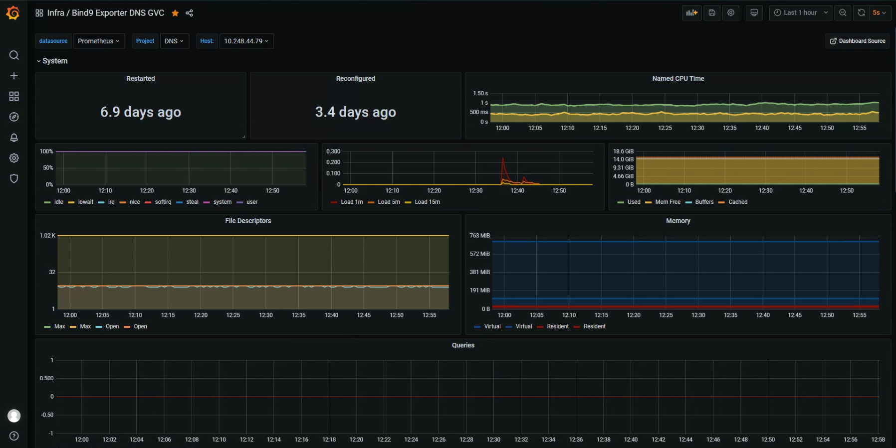
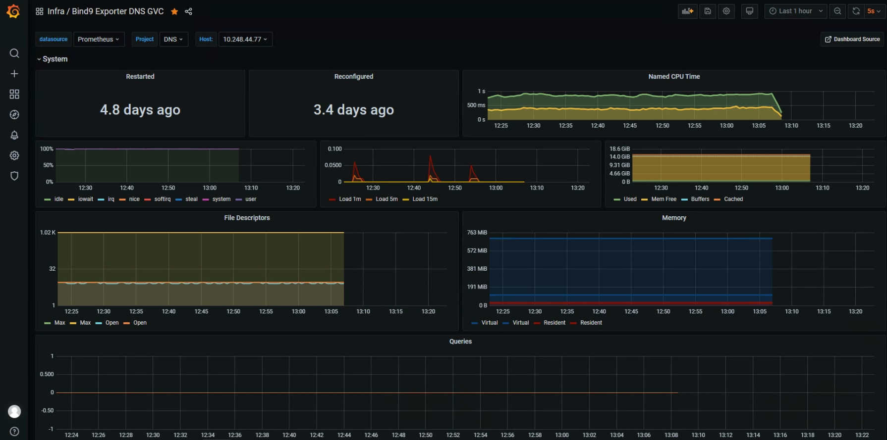
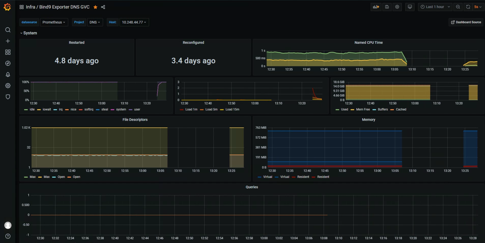
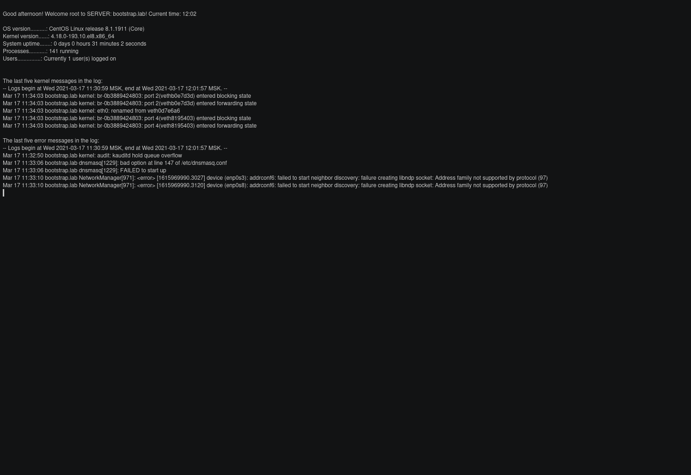
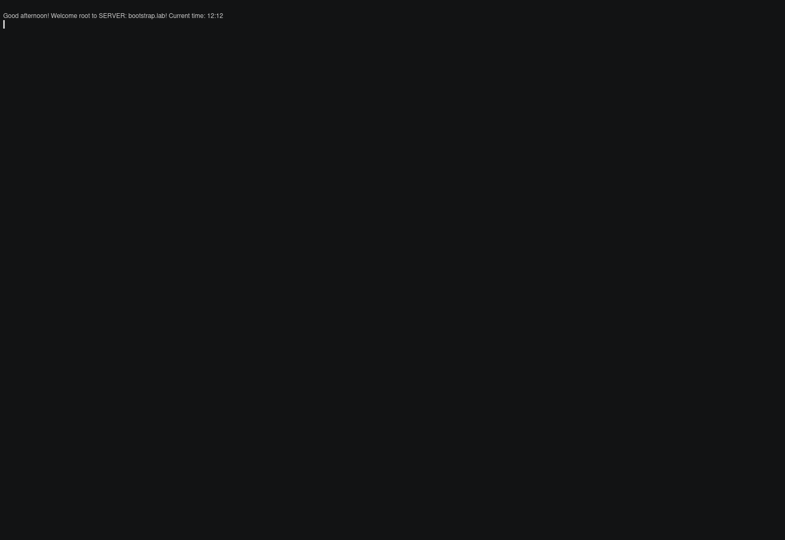
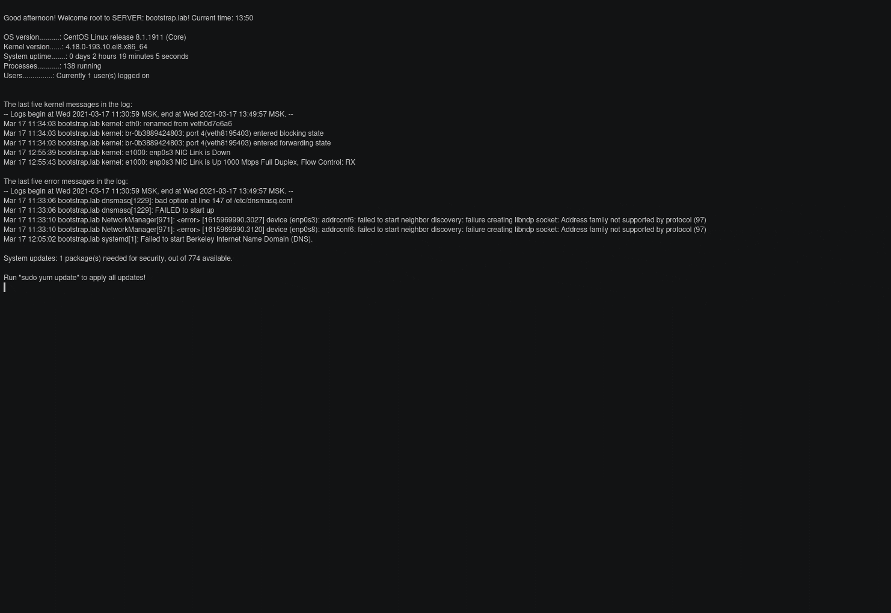

# Инструкция сменного персонала DNS

 ??? abstract
    1. [Общее описание](#общее-описание)
    2. [Диагностика](#проверка-работоспособности)
    3. [Устранение сбоя](#устранение-сбоя)

## Общее описание

## Проверка работоспособности

### 1. Необходимо проверить доступность и сбор метрик в Grafana.
   
   1.1. Сервер доступен
   
   Если сервер доступен необходимо выполнить разрешение имен.
   
   1.2. Сервер не доступен
   
   Если сервер не доступен следует проверить проверить доступность по сети и зайти на сервер по SSH, и проверить состояние сервиса. При недоступности по сети проверить состояние сервера или виртуальной машины, должна находится в статусе `PowerOn`.
   
   1.3. Убедившись в возобновление доступности
   
   Необходимо выполнить разрешение имен.

### 2. Проверка состояния сервиса.

Для проверки необходимо запустить сценарий проверки: `named-healthy-check`. Так как сервис может быть запушен в разных режимах с подменой дерева каталогов (unit name: named-chroot.service) или без (unit name: named.chroot), сценарий проверяет какой из них активирован. Выводя состояние для каждого режима: ENABLE и DISABLE. Выполняет проверки: запущен ли сервис, валидность синтаксиса файлов конфигурации, валидность файлов зон.
   
   2.1
   
   
   2.2
   
   
   2.3
   

### 3. 

### 4. 

## Устранение сбоя
